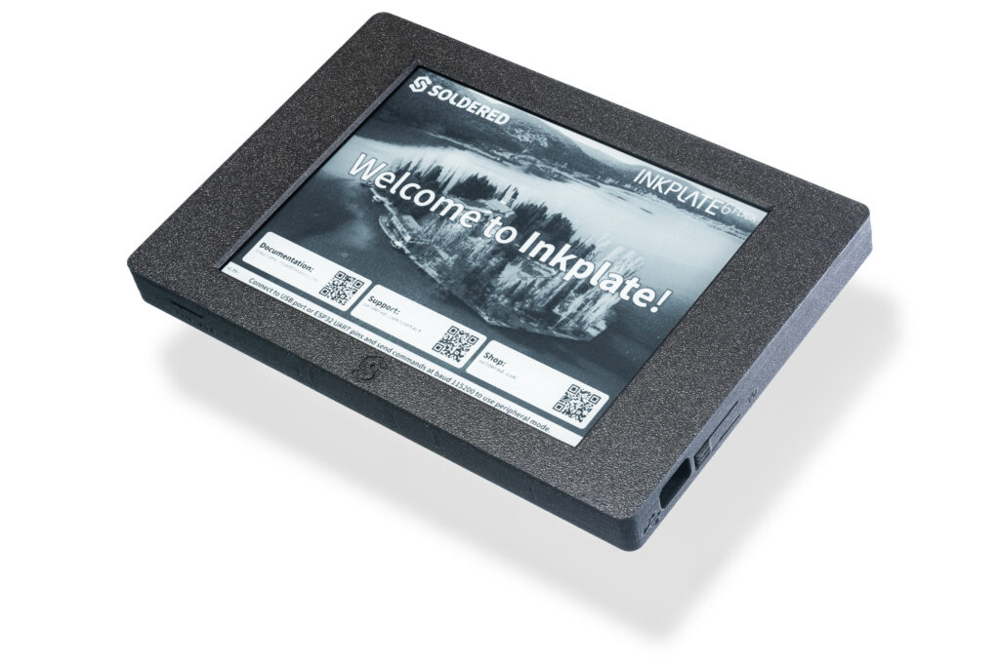
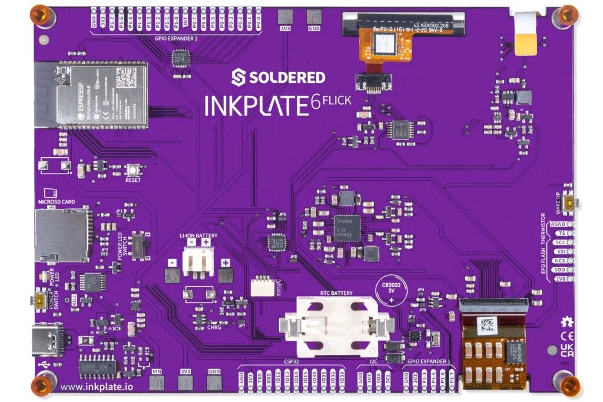
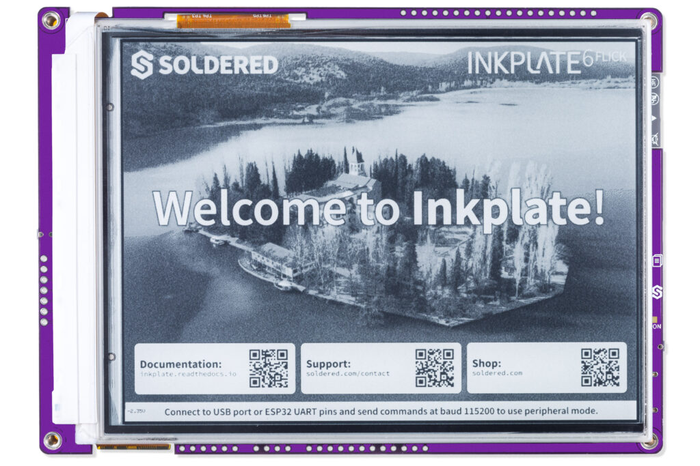
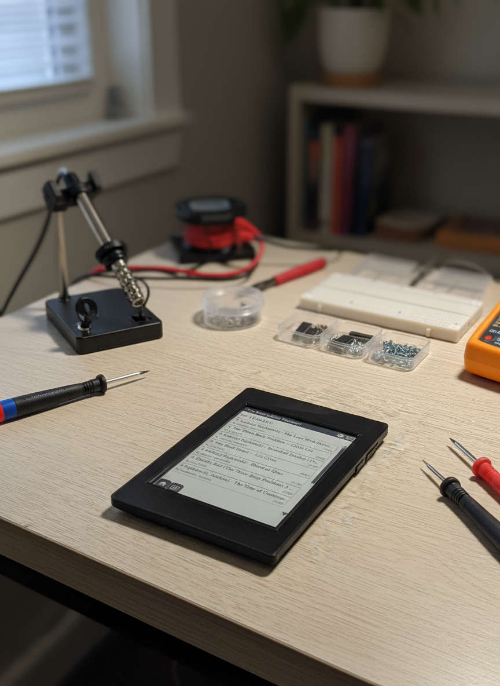
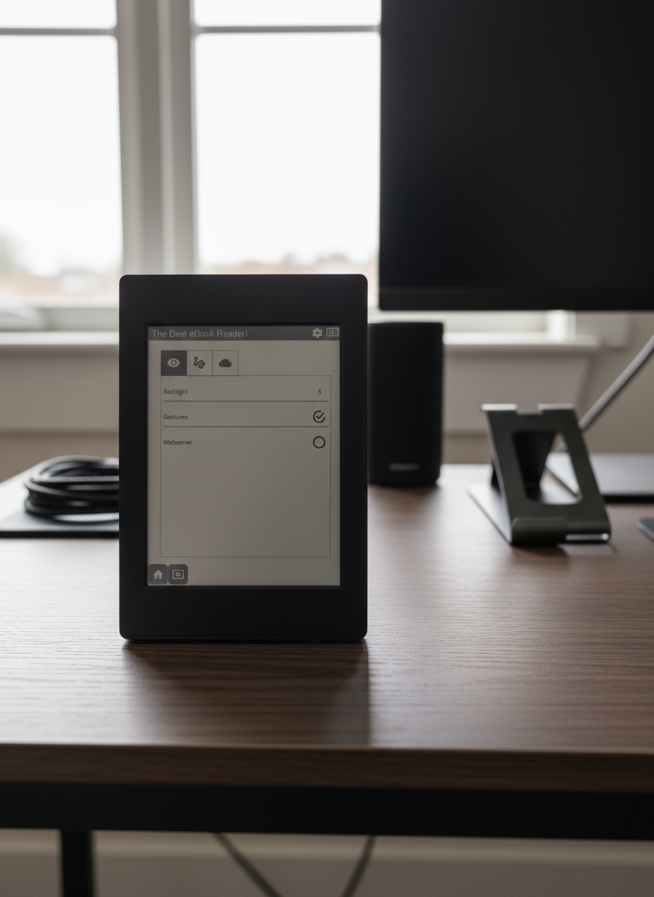
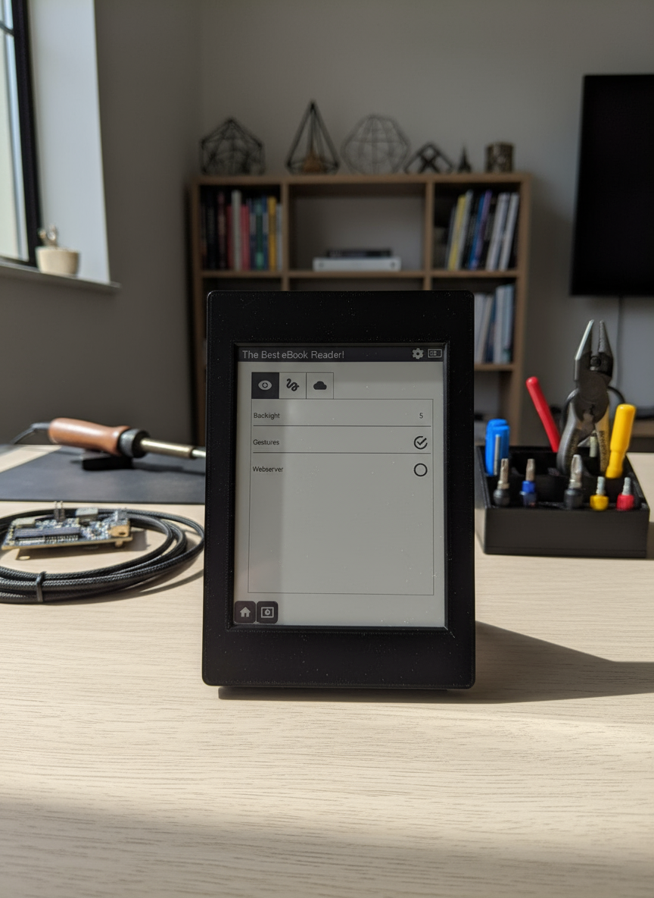

# InkBook: DIY Open-Source eBook Reader with InkPlate 6 Flick

I would like to introduce you to InkBook! Build your own fully-featured eBook reader from scratch using an InkPlate 6 Flick development board. This project delivers native EPUB parsing, gesture-based navigation, battery-powered operation, and complete library management - all with open-source hardware and software!

## Overall Description and Intent

The goal of this project was to create a truly open and customizable eBook reader that rivals commercial devices while remaining completely hackable and modifiable. Unlike proprietary e-readers that lock you into specific ecosystems, this DIY solution gives you complete control over your digital library and reading experience.

**Key motivations:**
- Full control over your eBook collection without DRM restrictions
- Native EPUB support without requiring conversion to other formats
- Touch-based navigation with intuitive gestures
- Weeks of battery life through efficient e-paper technology
- Expandable functionality through open-source codebase
- Utilizing Arduino ESP32 Library
- Great platform to learn about E-Ink displays and ESP32

The project leverages the InkPlate 6 Flick's excellent recycled e-paper displays combined with custom firmware to create a reading experience optimized for long-form text consumption. The 6-inch display provides ample reading space while maintaining the paper-like appearance that makes e-ink displays so comfortable for extended reading sessions. Other cool hardware features are the adjustable backlight, partial display updates and high resolution of 1024×758 pixels, for confortable reading and image rendering.

## Key Features Showcase

### Current Capabilities
- **Native EPUB parsing** - No conversion required, reads .epub files directly
- **Full gesture navigation** - Swipe left/right for pages, up/down for chapters
- **Complete library management** - Browse, select, and organize your book collection
- **SD card storage** - Load books via microSD card for massive storage capacity
- **Adjustable backlight** - 64 levels of brightness control for any lighting condition
- **Progress tracking** - Automatically saves your reading position
- **Multiple font options** - Choose from serif, sans-serif fonts in various sizes (only adjustable from code currently)
- **Image rendering** - Display book covers, illustrations, and diagrams natively
- **Automatic pagination** - Smart text flow with chapter detection
- **Partial screen refresh** - Fast page turns with minimal full screen flicker
- **Battery monitoring** - Real-time battery level display
- **Battery charging** - Built in charging capability
- **Automatic EPUB indexing** - Fast navigation and page caching
- **3-D Printable Case** - Case designed and provided for free from Inkplate

### Performance Highlights
- **Battery life**: Over 1 week of continuous use
- **Display**: 6" e-paper with 1024×758 pixel resolution
- **Refresh rate**: Under 1 second for page turns
- **Storage**: Virtually unlimited via microSD cards
- **Icons**: Support for Icon rendering for enhanced UI experience
- **Language support**: English characters (with plans for expansion)

## Images and Videos Section

### **Hardware Overview:**
- InkPlate 6 Flick board with e-paper display
- SD card slot and battery connection
- Touch-responsive screen surface
- More info [at Inkplate Docs](https://soldered.com/documentation/inkplate/6flick/overview/)

### **Software Interface:**
- Main library browser showing book collection
- Reading interface with text and image rendering
- Settings menu with backlight controls and other features
- Progress tracking and chapter navigation

<!--  -->

### **Navigation Demos:**

<!--  -->

## Components List

### Core Hardware
- **InkPlate 6 Flick Development Board** - Main processing unit with ESP32 and 6" e-paper display
- **MicroSD Card** - For book storage (32GB+ recommended)
- **Lithium Battery** - 3.7V LiPo battery for portable operation
- **USB-C Cable** - For charging and programming

### Optional Accessories
- **3D Printed Case** - Protective enclosure (STL files can be created)
- **MicroSD Card Reader** - For transferring books from computer

### Development Tools
- **Arduino IDE** - Primary development environment
- **USB-C Cable** - For code upload and debugging

## Getting Started - Build Your Own

### Prerequisites
1. **Install Arduino IDE** (latest version recommended)
2. **Add InkPlate Board Support**:
   - Follow their [Quick Start Guide here](https://soldered.com/documentation/inkplate/6flick/quick-start-guide/)

3. **Install Required Libraries**:
   - Inkplate Arduino Library (via Library Manager)
   - TinyXML2 Library (for EPUB parsing)
   - ArduinoJson Library (for metadata handling)
   - unzipLIB Library (for handling .zip and epub files)

### Hardware Setup
1. **Prepare the InkPlate 6 Flick**:
   - Connect lithium battery (if using battery power)
   - Insert microSD card with EPUB files
   - Connect USB-C for initial programming

2. **Load Books**:
   - Copy the contents of the sdcard/ folder to the root of the microSD card
   - Copy .epub files to a folder called "books" in the root directory of your microSD card
   - Organize in folders if desired (library will scan recursively)

### Software Installation
1. **Download the Source Code**:
   - Clone or download the project repository
   - Open `ebook_reader.ino` in Arduino IDE

2. **Configure Board Settings**:
   - Select "Inkplate 6(ESP32)" from Tools → Board
   - Choose appropriate COM port
   - Set upload speed to 921600 baud

3. **Compile and Upload**:
   - Click Upload to flash firmware to device
   - Monitor serial output for debugging info

### First Boot
1. Power on the device - you should see loading screen
2. Main library will display available books from SD card
3. Touch a book title to begin reading
4. Use gestures to navigate:
   - Swipe right: Next page
   - Swipe left: Previous page
   - Swipe down: Next section
   - Swipe up: Previous section
   - Tap menu area: Access settings

### Customization Options
- Add/Modify font sizes and families in `UIManager.cpp`
- Adjust gesture sensitivity in touch handling code
- Add new features by extending the existing modules

## Future Development Roadmap

### Software Improvements Ideas
- **WiFi connectivity** - Over-the-air library management and book upload
- **Enhanced user settings** - More customization options
- **Reading statistics** - Track reading speed, time spent, books completed
- **Note-taking system** - Highlight text and add personal annotations
- **Hyperlink support** - Chapter-to-chapter navigation within books
- **Multi-language support** - Unicode character handling for international texts
- **Advanced search** - Full-text search within books and library

### Hardware Improvement Ideas
- Custom PCB design for even smaller form factor
- Solar charging integration for indefinite battery life
- Improved case design with better ergonomics

## Credits and Acknowledgments

### External Libraries and Partners
- **Soldered Electronics** - For the excellent InkPlate 6 Flick hardware platform and Arduino library support
- **TinyXML2** by Lee Thomason - Lightweight XML parsing library enabling EPUB file processing
- **Arduino Community** - For the development environment and extensive documentation
- **Espressif** - ESP32 microcontroller and development frameworks

### Development Tools
- **Arduino IDE** - Primary development environment
- **InkPlate Arduino SDK** - Hardware abstraction and display drivers

### Hardware Reference
This project is built upon the InkPlate 6 Flick reference design and documentation provided by Soldered Electronics. Their open-hardware approach made this project possible.

### Community Contributions
Special thanks to the open-source hardware community for inspiration and the existing e-reader projects that paved the way for this implementation.

## License and Open Source

This project is released under an open-source license, encouraging modification, redistribution, and community contribution. All source code, documentation, and design files will be made available through public repositories.

**Repository Structure:**
- `/src` - Main firmware source code
- `/libs` - Custom library implementations
- `/docs` - Build guides and technical documentation

## Get Involved

This project welcomes contributions from the community:

- **Code contributions** - Bug fixes, feature additions, optimizations
- **Documentation** - Improve build guides, add language translations  
- **Testing** - Try different EPUB files, report compatibility issues
- **Hardware mods** - Share case designs, battery upgrades, mounting solutions
- **Feature requests** - Suggest new capabilities and improvements

Join the growing community of open-source e-reader enthusiasts and help make digital reading more accessible and customizable for everyone!

---

*Ready to build your own? Get started with your custom InkBook and begin your journey into open-source reading technology!*